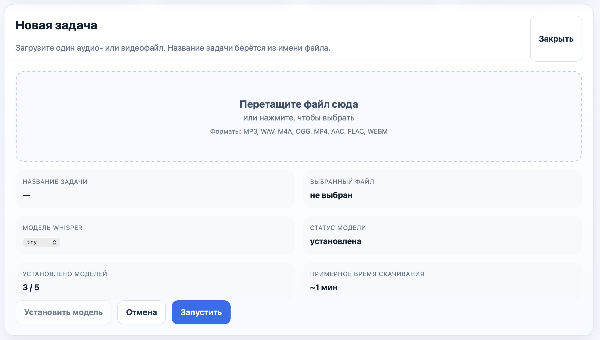
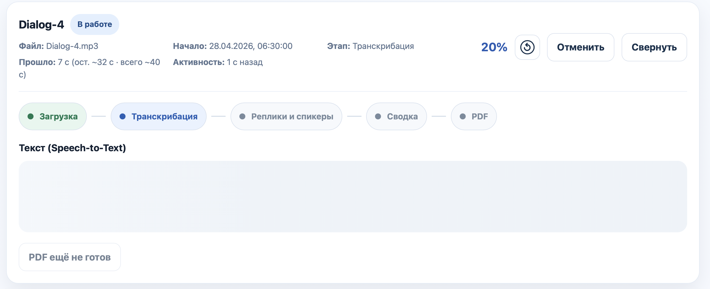
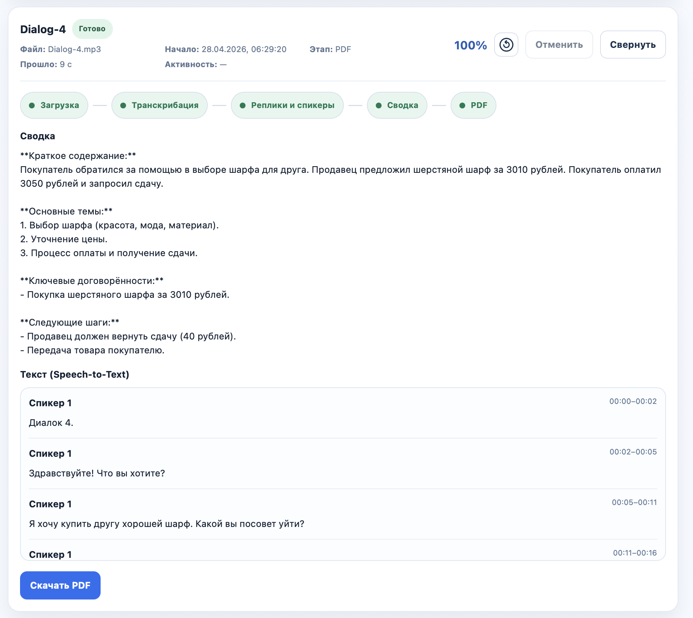
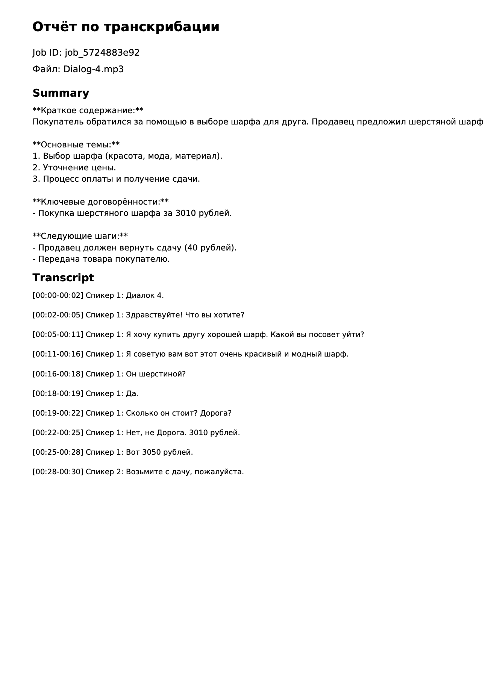
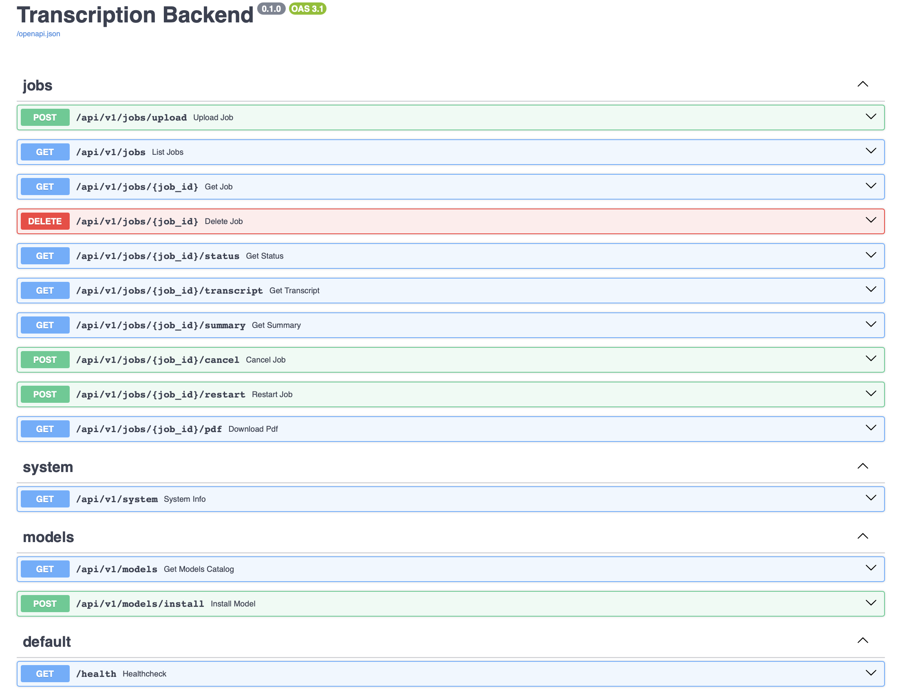

# Self-Hosted Transcription Web App

Локальное веб-приложение для обработки аудио: Whisper-транскрибация, AI-сводка и генерация PDF-отчётов.

Все файлы и данные обрабатываются и хранятся исключительно на вашем компьютере — ничего не отправляется во внешние сервисы (за исключением summary-провайдера, если он включён).

Стек: FastAPI + React + SQLite
Запуск одной командой через Docker Compose

---

## Как выглядит приложение
### Frontend
Основной пользовательский сценарий:
- загрузка аудиофайла
- отслеживание статуса обработки
- просмотр транскрипта и summary
- скачивание PDF

Загрузка и обработка



Результат

  
PDF отчёт


---

### Backend / API

FastAPI предоставляет Swagger UI для работы с API:


Доступ:
- API: http://localhost:8000
- Swagger UI: http://localhost:8000/docs

---

## Структура проекта
```text
transcription-app/  
	backend/  
		app/  
			api/routes/  
			core/  
			models/  
			repositories/  
			schemas/  
			services/  
			db.py  
			main.py  
		Dockerfile  
		requirements.txt  
	frontend/  
		src/  
		components/  
			services/api.ts  
			App.tsx  
		Dockerfile  
	docker-compose.yml
```

---

Запуск через Docker Compose
```bash
docker compose up --build
```

Запуск в фоне:
```bash
docker compose up -d
```

Остановка:
```bash
docker compose down
```
---

# Доступ к сервисам

| Сервис   | URL                        |
| -------- | -------------------------- |
| Frontend | http://localhost:5173      |
| Backend  | http://localhost:8000      |
| Swagger  | http://localhost:8000/docs |

---

## API
Базовый префикс: /api/v1
### Основные эндпоинты

- GET /health  
    Проверка работоспособности сервиса
- POST /jobs/upload  
    Загрузка аудиофайла
- GET /jobs  
    Список задач
- GET /jobs/{job_id}  
    Информация о задаче
- GET /jobs/{job_id}/status  
    Статус обработки
- GET /jobs/{job_id}/transcript  
    Транскрипт
- GET /jobs/{job_id}/summary  
    Сводка
- GET /jobs/{job_id}/pdf  
    Скачать PDF
- DELETE /jobs/{job_id}  
    Удалить задачу

---

## Пример использования API

Загрузка файла:
```bash
curl -X POST "http://localhost:8000/api/v1/jobs/upload" \  
  -F "file=@./sample.wav"
```

Скачивание PDF:
```bash
curl -L "http://localhost:8000/api/v1/jobs/{job_id}/pdf" -o result.pdf
```

---

## Локальный запуск без Docker

### Backend
```bash
cd backend  
python -m venv .venv  
source .venv/bin/activate   # Windows: .venv\Scripts\activate  
pip install -r requirements.txt  
uvicorn app.main:app --reload
```
### Frontend
```bash
cd frontend  
npm install  
npm run dev
```

---

## Troubleshooting

### SQLite ошибка
Создать папку:
```bash
mkdir -p backend/data
```

---